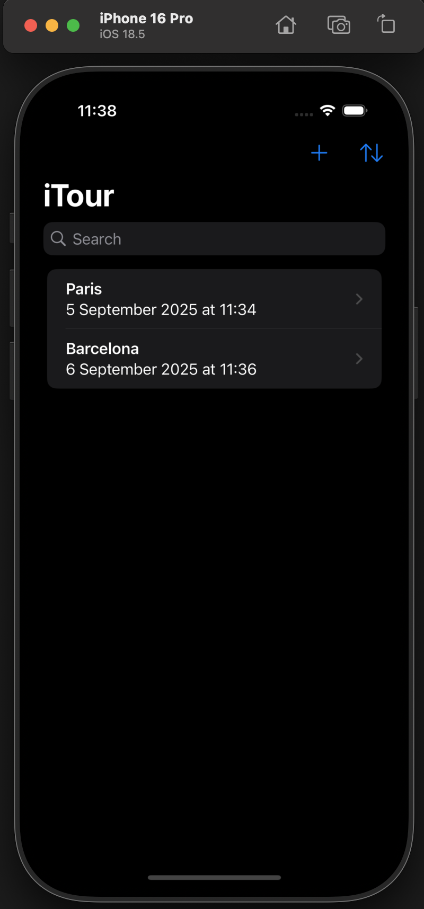
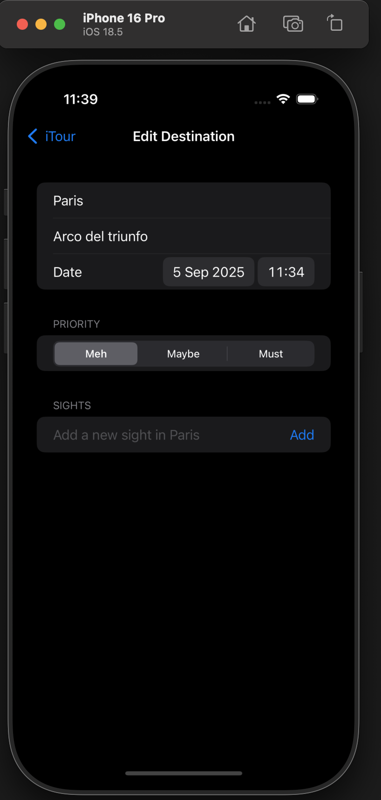

# 🌍 iTour

**iTour** es una aplicación desarrollada en **Swift** y **SwiftUI** que permite organizar viajes de forma sencilla, utilizando **SwiftData** para la persistencia local. Su objetivo es ayudar al usuario a planificar destinos, establecer prioridades y llevar un control de lugares para visitar dentro de cada viaje.

## 📸 Preview

  
  

---

## 📱 Características principales

La aplicación está diseñada con una interfaz moderna y limpia, optimizada para la experiencia en iOS. Desde la **pantalla principal**, el usuario puede:

- **Buscar destinos** por nombre de ciudad o país mediante un buscador.
- **Añadir nuevos destinos** a su lista personalizada.
- **Ordenar los viajes** según:
  - **Nombre**
  - **Prioridad**
  - **Fecha**

---

## ✅ Flujo de Creación de Viajes

Al pulsar en **"Añadir destino"**, se accede a una pantalla compuesta por **3 secciones principales**:

### 1️⃣ **Información del destino**
- Campo de **nombre del destino**.
- **Detalles adicionales** para notas o información relevante.
- Selector de **fecha y hora** para planificar el viaje.

### 2️⃣ **Prioridad del viaje**
- Selector para definir el nivel de importancia:
  - **Meh** → Baja prioridad.
  - **Maybe** → Intermedia.
  - **Must** → Alta prioridad.

### 3️⃣ **Sitios adicionales**
- Sección dedicada para **añadir más lugares dentro del destino principal**.
- Permite planificar varios puntos de interés en un solo viaje.

---

## 🛠️ Tecnologías y herramientas

- **Lenguaje**: Swift 5+
- **Framework**: SwiftUI
- **Persistencia:** SwiftData (modelo basado en `@Model`).
- **Gestión de Estado:** `@State`, `@Binding`, `@Observable` para control reactivo.
- **Componentes principales:**
  - `NavigationStack` para navegación moderna.
  - `List` y `ForEach` para mostrar los destinos.
  - `Picker` para selección de prioridad.
  - `DatePicker` para fecha y hora.
  - `Button` para añadir destinos y ordenar la lista.
  - `SearchBar` (basada en `TextField`) para búsqueda dinámica.

---

## ▶️ Flujo de la aplicación
- **Pantalla principal**
   - Buscar destinos.
   - Ver lista de viajes organizados.
   - Ordenar por **nombre**, **prioridad** o **fecha**.
- **Añadir nuevo destino**
   - Introducir nombre, detalles y fecha.
   - Seleccionar prioridad.
   - Añadir lugares adicionales dentro del viaje.
- **Gestión completa**
   - Visualizar y editar los viajes organizados.

---

## 🛠️ Tecnologías y herramientas
- **Swift 5.9+**
- **SwiftUI** para una interfaz declarativa y adaptativa.
- **SwiftData** para persistencia local sin Core Data manual.
- **Property Wrappers** (`@Model`, `@State`, `@Binding`) para control del estado.
- **NavigationStack** y **Sheets** para flujo de navegación.
- **Ordenación dinámica** mediante `SortDescriptor`.

---

## 📱 Requisitos

- **iOS 17.0 o superior**
- **Xcode 15 o superior**
- **Simulador o dispositivo compatible con SwiftUI**
